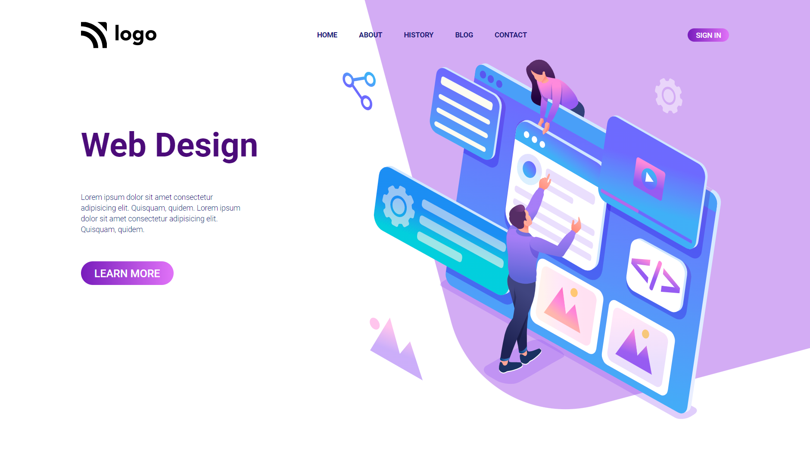

# **Khushal Shimpi**

## Project - 8 

## Project Title - Web Design Landing page
This is the landing page of web design.

##  Time to complete this project :-

## What I have Learned in this Project :-

- Layout Making Using - **Flexbox**.
- How to give - **Position to Element**.
- Make - **Buttons & Linear Gredient**.
- How to Use of - **Fonts**.

## Technology Used :-

Project  built from using

 
&

[Click Me](https://regal-banoffee-0d1342.netlify.app/) to see the project Demo.

## Screenshot of  project :-

## Features :-

- Live previews
- Fullscreen mode
- Mobile responsive
- Tablet responsive

## 🔗 Links

